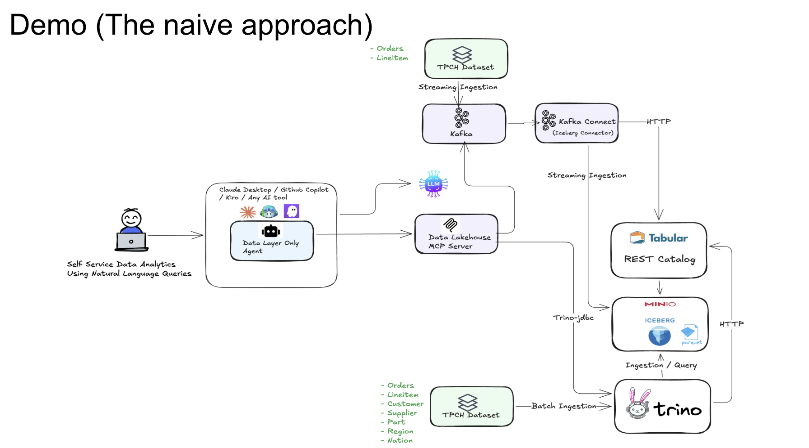
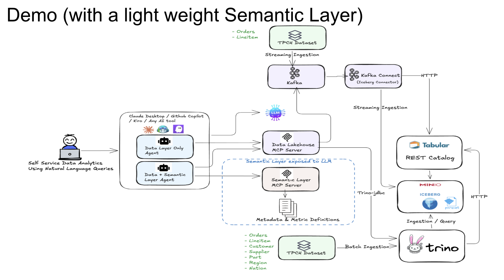

# Streaming Data Platform Demo

Demo for the talk: **"Natural Language Analytics on the Open Lakehouse: Why is it harder than it looks?"**

## Overview

This demo shows how AI agents interact with a real-time streaming data platform — and where they struggle without semantic context. It uses the TPC-H dataset with a Kafka streaming pipeline that continuously produces orders and lineitems into Iceberg tables.

Two scenarios are compared:

- **Scenario One**: Agent with data layer access only — queries Iceberg directly, guesses business logic, gets inconsistent answers

  

- **Scenario Two**: Agent with data layer + lightweight glossary — uses a business dictionary to understand table semantics before writing SQL

  


## Repository Structure

```
SemanticMCPLightWeight/
├── docker-compose.yml                ← start the full streaming platform
├── trino/                            ← Trino config + TPC-H + streaming_db init SQL
├── kafka-connect/
│   ├── Dockerfile                    ← cp-kafka-connect + Iceberg sink connector
│   ├── setup-connector.sh            ← one-time build of Iceberg connector JARs
│   ├── connectors/                   ← Iceberg sink connector configs (orders, lineitems)
│   └── plugins/                      ← connector JARs land here after setup-connector.sh
├── akhq/
│   └── application.yml               ← AKHQ Kafka UI config
├── KafkaProducer/                    ← Java Spring Boot producer (reads Trino, publishes to Kafka)
├── StreamingDataLakeHouseMCP/        ← MCP server: Trino/Iceberg + Kafka tools
├── GlossaryMCP/                      ← MCP server: lightweight business glossary
└── glossary/
    └── tpch-glossary.yml             ← business rules, column definitions, metric formulas
```

## Architecture

See the diagrams above in the Overview section for a visual breakdown of each scenario.

## Streaming Data Design

- `ice_db` — historical TPC-H batch data (loaded at startup, static)
- `streaming_db` — real-time data landed via Kafka Connect:
  - `orders` and `lineitems` — streamed continuously with today's dates, new unique keys
  - `customer`, `supplier`, `nation`, `region`, `part`, `partsupp` — copied once from `ice_db` at init so all joins stay within `streaming_db`

The Java producer reads all 15k TPC-H orders from Trino, rewrites dates to today, and publishes batches of 10 orders + their lineitems every 5 seconds. When it exhausts the dataset it wraps around with new unique keys to simulate continuous activity.

## Services

| Service | Port | Purpose |
|---------|------|---------|
| Trino | 8080 | SQL query engine |
| Kafka | 9092 | Message broker (Confluent KRaft) |
| Kafka Connect | 8083 | Iceberg sink connector |
| AKHQ | 8086 | Kafka UI — visualise topics and messages |
| MinIO | 9001 | Object storage UI |
| Iceberg REST | 8181 | Iceberg catalog |

## Quick Start

### Prerequisites

- Docker Desktop with ≥10GB RAM (Kafka adds overhead)
- Java 17+ (`java -version`)
- Maven 3.9+ (`mvn -version`)
- git (for building the Iceberg connector)

### Step 1: Build the Iceberg Kafka Connect plugin (one-time only)

The Apache Iceberg Kafka Connect runtime is not available as a pre-built download — it must be built from source. This is a one-time step; the JARs are cached in `kafka-connect/plugins/`.

```bash
cd SemanticMCPLightWeight
chmod +x kafka-connect/setup-connector.sh
./kafka-connect/setup-connector.sh
```

This clones the Apache Iceberg repo at tag `1.7.1`, builds only the kafka-connect runtime module (skipping tests), and extracts the JARs. Takes ~3-5 minutes on first run.

### Step 2: Build the Kafka Connect image

```bash
docker compose build kafka-connect
```

This bakes the connector JARs into the image. Only needed once (or after re-running setup-connector.sh).

### Step 3: Build the Java Kafka Producer

```bash
cd KafkaProducer
mvn clean package -q
cd ..
```

### Step 4: Start the platform

```bash
docker compose up -d
```

Wait ~90 seconds for everything to initialise. Check readiness:

```bash
# Trino + TPC-H data loaded
docker logs trino --follow   # wait for "Initialization complete."

# Kafka Connect + Iceberg sink registered
docker logs kafka-connect --tail 30

# Producer streaming
docker logs kafka-producer --tail 20
```

### Step 5: Build and start the MCP servers

```bash
# Streaming data layer MCP (Trino + Kafka tools)
cd StreamingDataLakeHouseMCP
mvn clean package -q
java -jar target/streaming-datalakehouse-mcp-0.1.0.jar

# Glossary MCP (business dictionary)
cd ../GlossaryMCP
mvn clean package -q
java -jar target/glossary-mcp-java-0.1.0.jar \
  --glossary.file.path=../glossary/tpch-glossary.yml
```

## Verify the Streaming Pipeline

Open AKHQ at http://localhost:8086 — you should see `tpch.orders` and `tpch.lineitems` topics with messages flowing in.

Check streaming_db tables in Trino:

```sql
-- Should grow over time as Kafka Connect commits Iceberg snapshots (every 30s)
SELECT COUNT(*) FROM semantic_demo.streaming_db.orders;
SELECT COUNT(*) FROM semantic_demo.streaming_db.lineitems;

-- Reference tables (static, copied from ice_db at init)
SELECT COUNT(*) FROM semantic_demo.streaming_db.customer;  -- 1500
SELECT COUNT(*) FROM semantic_demo.streaming_db.nation;    -- 25
SELECT COUNT(*) FROM semantic_demo.streaming_db.region;    -- 5
```

## AI Client Configuration

Both MCP servers communicate over stdio. Any MCP-compatible AI client works — Claude Code, Kiro, GitHub Copilot, and others.

**Key rule:**
- **Scenario One** (data layer only) — start only `StreamingDataLakeHouseMCP`, configure only that server
- **Scenario Two** (data layer + glossary) — start both servers, configure both in your client

Update the jar paths and glossary path to match your local clone.

> **Note on `--glossary.file.path`**: The GlossaryMCP defaults to `glossary/tpch-glossary.yml` relative to its working directory. When running manually from the repo root this resolves correctly without the flag. However, AI clients launch the process from an unpredictable working directory, so always pass an **absolute path** in MCP configs.

### Scenario One — Data Layer Only

```json
{
  "mcpServers": {
    "streaming-lakehouse": {
      "command": "java",
      "args": ["-jar", "/path/to/StreamingDataLakeHouseMCP/target/streaming-datalakehouse-mcp-0.1.0.jar"]
    }
  }
}
```

### Scenario Two — Data Layer + Glossary

```json
{
  "mcpServers": {
    "streaming-lakehouse": {
      "command": "java",
      "args": ["-jar", "/path/to/StreamingDataLakeHouseMCP/target/streaming-datalakehouse-mcp-0.1.0.jar"]
    },
    "glossary": {
      "command": "java",
      "args": [
        "-jar", "/path/to/GlossaryMCP/target/glossary-mcp-java-0.1.0.jar",
        "--glossary.file.path=/path/to/glossary/tpch-glossary.yml"
      ]
    }
  }
}
```

## Agent Files

Pre-built agent definitions for each scenario are included for all three supported AI clients. Each client has a `data-layer-only` and a `data-and-semantic-layer` variant.

```
.kiro/steering/                          ← Kiro steering files (load via # in chat)
  data-layer-only.md
  data-and-semantic-layer.md

.claude/agents/                          ← Claude Code sub-agents
  data-layer-only.md
  data-and-semantic-layer.md

.github/agents/                          ← GitHub Copilot agent mode
  data-layer-only.md
  data-and-semantic-layer.md
```

### Claude Desktop

Config location:
- macOS: `~/Library/Application Support/Claude/claude_desktop_config.json`
- Windows: `%APPDATA%\Claude\claude_desktop_config.json`

Paste the appropriate MCP JSON above and restart Claude Desktop. For the demo, open two separate Claude Desktop windows — one per scenario.

### Claude Code

Place the MCP config in `.claude/settings.json` at the repo root. Claude Code automatically picks up sub-agents from `.claude/agents/` — select `data-layer-only` or `data-and-semantic-layer` depending on the scenario.

### Kiro

Place the MCP JSON in `~/.kiro/settings/mcp.json` (user-level) or `.kiro/settings/mcp.json` (workspace-level). Load the matching steering file in chat using `#data-layer-only` or `#data-and-semantic-layer`.

> Note: For a clean Scenario One vs Two comparison, use two separate Kiro workspace windows with different `mcp.json` configs.

### GitHub Copilot

MCP servers are configured in `.vscode/mcp.json`. Note the key is `servers`, not `mcpServers`:

**Scenario One:**
```json
{
  "servers": {
    "streaming-lakehouse": {
      "command": "java",
      "args": ["-jar", "/path/to/StreamingDataLakeHouseMCP/target/streaming-datalakehouse-mcp-0.1.0.jar"]
    }
  }
}
```

**Scenario Two:**
```json
{
  "servers": {
    "streaming-lakehouse": {
      "command": "java",
      "args": ["-jar", "/path/to/StreamingDataLakeHouseMCP/target/streaming-datalakehouse-mcp-0.1.0.jar"]
    },
    "glossary": {
      "command": "java",
      "args": [
        "-jar", "/path/to/GlossaryMCP/target/glossary-mcp-java-0.1.0.jar",
        "--glossary.file.path=/path/to/glossary/tpch-glossary.yml"
      ]
    }
  }
}
```

Agent definitions in `.github/agents/` are picked up automatically by Copilot's agent mode — select the appropriate one for each scenario.

## Testing MCP Servers

Use MCP Inspector to test tools interactively before the demo:

```bash
# Test StreamingDataLakeHouse MCP
npx @modelcontextprotocol/inspector java -jar StreamingDataLakeHouseMCP/target/streaming-datalakehouse-mcp-0.1.0.jar
```

Opens at `http://localhost:6274`. Try:
- `trino_catalogs()` → should return `semantic_demo`, `system`, `tpch`
- `trino_iceberg_tables("semantic_demo", "ice_db")` → 8 tables
- `trino_iceberg_tables("semantic_demo", "streaming_db")` → orders, lineitems + reference tables
- `list_kafka_topics()` → `tpch.orders`, `tpch.lineitems`
- `get_kafka_consumer_lag("tpch.orders")` → lag for `iceberg-connect-group`

```bash
# Test Glossary MCP
npx @modelcontextprotocol/inspector java -jar GlossaryMCP/target/glossary-mcp-java-0.1.0.jar \
  --glossary.file.path=/path/to/glossary/tpch-glossary.yml
```

Try:
- `list_entities()` → all TPC-H tables with descriptions
- `get_entity_context("orders")` → column details, `orderstatus` allowed values, business rules
- `search_glossary("completion")` → finds the completion rate business rule
- `get_metric_definition("revenue")` → `SUM(extendedprice * (1 - discount))`

## Demo Questions

### Q1: "Show me the latest orders coming in — what do they look like?"

**Scenario One**: Agent calls `get_recent_kafka_messages("tpch.orders", 5)` — sees raw JSON. Then queries `streaming_db.orders` to count records. Straightforward.

**Scenario Two**: Same, but agent also calls `get_entity_context("orders")` to understand what `orderstatus` values mean before writing any analysis SQL.

**Talking point**: The stream is visible. The data is real. But the meaning isn't in the data.

---

### Q2: "What's our order completion rate from the streaming data?"

**Scenario One**: Agent sees `orderstatus` with values `F`, `O`, `P` and guesses. May include `P` as completed — wrong.

**Scenario Two**: Agent calls `search_glossary("completion")` → gets the business rule (`F` only). Writes correct SQL against `streaming_db.orders`.

**Talking point**: Same problem as the batch data. The stream doesn't carry business semantics.

---

### Q3: "Which customers are generating the most revenue in the stream?"

**Scenario One**: Attempts a JOIN across `streaming_db.orders → streaming_db.lineitems → streaming_db.customer`. May miss the discount calculation.

**Scenario Two**: Agent calls `get_metric_definition("revenue")` → gets `SUM(extendedprice * (1 - discount))`. Writes correct JOIN with correct revenue formula.

**Talking point**: The glossary is a hint, not an executable metric. The agent still writes SQL — but it writes the right SQL.

---

### Q4: "How far behind is the Iceberg sink? Is the data fresh?"

**Scenario Two only**: `get_kafka_consumer_lag("tpch.orders")` → shows lag for the `iceberg-connect-group`. If lag is low, data in `streaming_db` is near real-time.

**Talking point**: The agent can reason about data freshness — not just data content.

## Troubleshooting

**Kafka Connect not registering connectors**
```bash
docker logs kafka-connect | tail -30
# Check connector plugins are loaded:
curl http://localhost:8083/connector-plugins | grep -i iceberg
```

If the Iceberg plugin is missing, the `kafka-connect/plugins/` directory is empty. Re-run `setup-connector.sh` and rebuild the image.

**streaming_db tables not growing**
```bash
# Check connector status
curl http://localhost:8083/connectors/iceberg-sink-orders/status
# Check producer is running
docker logs kafka-producer --tail 20
```

**Full reset**
```bash
docker compose down -v
docker compose up -d
```

## Technology Stack

- Java 21, Spring Boot 3.4.5, Spring AI 1.0.1
- Apache Kafka (Confluent Platform 7.6.0, KRaft mode)
- Kafka Connect + Apache Iceberg Sink Connector 1.7.1
- AKHQ (Kafka UI)
- Apache Iceberg, Trino, MinIO
- Docker Compose
- MCP (Model Context Protocol)
